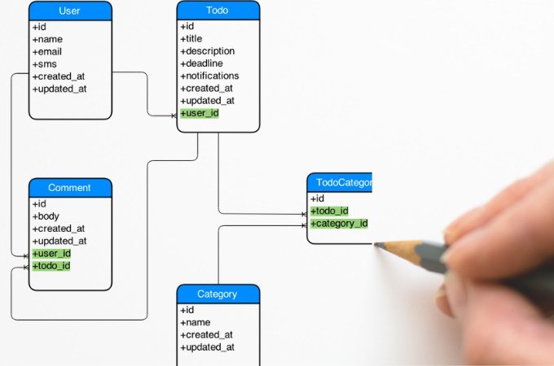

       

## How much the framework helps the raw html and css
When I first started creating a simple web page using raw HTML and CSS, it was more enjoyable than I had anticipated. It was fascinating to see the changes I made immediately appear on the screen. However, as I continued adding attributes and components that could perform various functions, I noticed that the screen was shifting in a direction that I had not intended. Although I may not have been familiar with HTML and CSS at the time, I soon realized that I lacked a well-organized HTML and CSS structure. This led me to feel as though I was only temporarily fixing the strange parts rather than creating clean code.
I found myself struggling to imagine creating a responsive web page using raw HTML and CSS. It became clear that my current approach was not sustainable, and I needed to invest time in learning the fundamentals of web development. I decided to enroll in a coding course to expand my knowledge and improve my skills.
 
Recently, I started learning Bootstrap5, a popular HTML and CSS framework, and since then, I have become much more comfortable with positioning and setting up various components. I've noticed that this has significantly reduced the amount of time I spend on coding, and it has made it easier to recognize a well-organized HTML and CSS structure.
One of the main benefits of using Bootstrap5 is the ease of creating a responsive website. By selecting the appropriate properties within the div class, I can ensure that components move and function as intended. As a result, I have been able to create web pages that I never thought were possible using raw HTML and CSS.
Overall, learning Bootstrap5 has been a game-changer for me in terms of web development. It has allowed me to work more efficiently and has expanded my capabilities as a developer. I am excited to continue exploring the capabilities of this powerful framework and to incorporate it into future web development projects.

 
## Is Bootstrap5 all-around to handle html and css?
Just because the framework is comfortable does not mean that we are in favor of the unconditional use of the framework. When working on the backend project before, something bad happened because of the server-side framework. This story is related to the back-end framework, but I think it can happen enough among front-end developers.
In Seoul, South Korea, there was a team of developers who were tasked with building a new web application for a popular cafe. The team was composed of frontend developers, backend developers, and a project manager who oversaw the project.
One afternoon, the team gathered at a bustling cafe in Gangnam to discuss the project. As they started discussing the technologies they wanted to use, a conflict arose between two of the backend developers, Joon and Yeon.
Joon was a seasoned developer who had experience working with a popular backend framework that he believed was the best option for the project. Yeon, on the other hand, had recently learned a newer framework that she believed would be more efficient and scalable for the project.
As they argued passionately about the best framework to use, the other team members became increasingly uncomfortable, and the project manager realized that this conflict could threaten the success of the project. He quickly intervened and suggested that the team take a break and explore both frameworks more deeply before making a decision. Later, the project was well-finished, but I think it could be more likely to happen for front-end developers who deal with the framework for JavaScript, html, and css. There are a much wider variety of frameworks available for front-end development than for back-end development, and new front-end technologies are emerging at a faster pace. Therefore, I believe it is important to carefully choose frameworks based on the specific needs and goals of the company or project you pursue, rather than blindly adhering to a particular framework.

