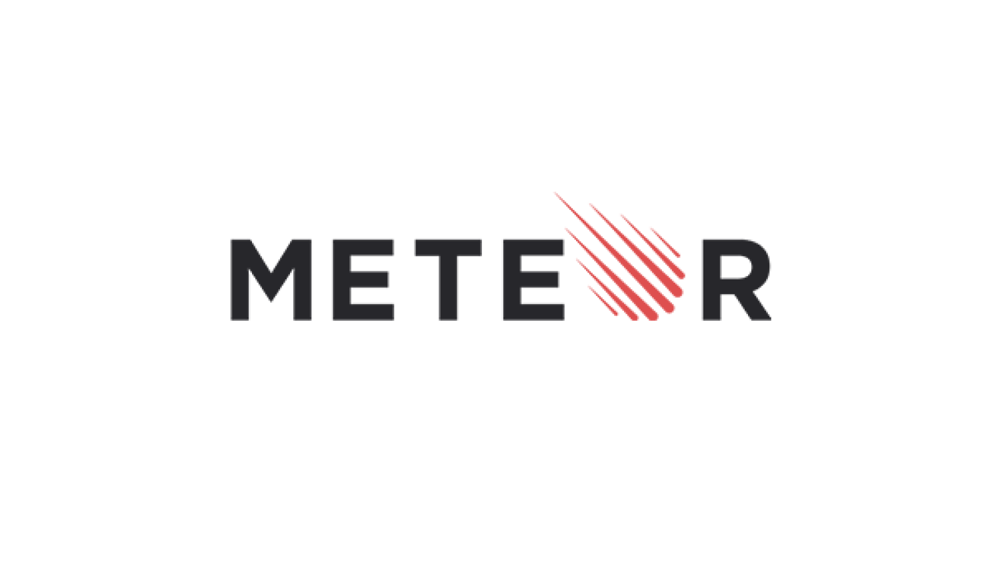

 
This semester in my Software Engineering class, I embarked on an enriching journey of learning and collaboration. Our primary task involved migrating an existing Meteor project, which originally utilized libraries like Semantic UI and Lodash, to a modernized version incorporating Bootstrap and more recent, efficient libraries. This essay encapsulates my experiences, challenges, and the invaluable lessons I learned during this course.

## Project Overview

  
  

 
The essence of our project was to enhance the user interface of all pages, making them more user-friendly and visually appealing. Our team, comprising seven members including myself, was tasked with achieving seven milestones throughout the project. Professor Moore played a crucial role, providing feedback after each milestone, guiding us on areas requiring improvement.

## Team Dynamics and Challenges

  

 
Collaborating in a team of seven brought its unique set of challenges. One of the primary hurdles was maintaining consistent progress, which heavily depended on the leadership exhibited in each team meeting. There were instances where a lack of decisive leadership impacted the team's efficiency. Personally, I faced challenges in contributing to the project due to technical issues encountered during the migration of libraries and the refactoring of code. This aspect of the project underscored the importance of effective communication, problem-solving, and adaptability in a team setting.

## Learning and Development

  

 
A notable learning experience for me was the creation of a button for database dumping. This feature was designed to remove specific or all collections, including slugs. Implementing this required a deep understanding of the pre-existing Meteor API, along with the intricate relationships and flows between various API files. This task underscored the importance of comprehensive knowledge in software development.

## Technical Learning and Skill Development
A particularly enlightening aspect of the project was developing a feature for database dumping. This required not only a theoretical understanding of how to remove specific or all collections, including slugs, but also a practical application of this knowledge. To successfully implement this feature, a comprehensive understanding of the pre-existing Meteor API was necessary. This task highlighted the intricate nature of software development where understanding legacy code and API interactions is crucial.

## Regular Code Reviews and Progress Tracking

  

 

Our weekly meetings on Mondays were dedicated to meticulous code reviews. These sessions involved examining specific files slated for migration and modification. They proved to be extremely beneficial, especially for those tasked with working on the reviewed pages afterward. This structured approach provided clear direction on the necessary fixes and UI design alterations.

## Balancing Academics and Project Work

  

 
One of the most challenging aspects of this project was balancing it with other academic responsibilities. The pace of progress often conflicted with our individual academic schedules. Despite these challenges, it was fulfilling to witness the team's ability to meet each milestone, demonstrating our commitment and ability to adapt. This experience highlighted the critical skills of time management and prioritization, essential in both academic and professional settings.

## Conclusion
In conclusion, my experience in this Software Engineering class has been a comprehensive journey of growth, encompassing technical skill development, teamwork, and project management. The challenges faced, and the lessons learned go beyond mere academic achievement; they are integral to my development as a future software engineer. This course has not only enhanced my technical abilities but also provided a deeper insight into the nuances of effective teamwork and the complexities of managing large-scale software projects.

