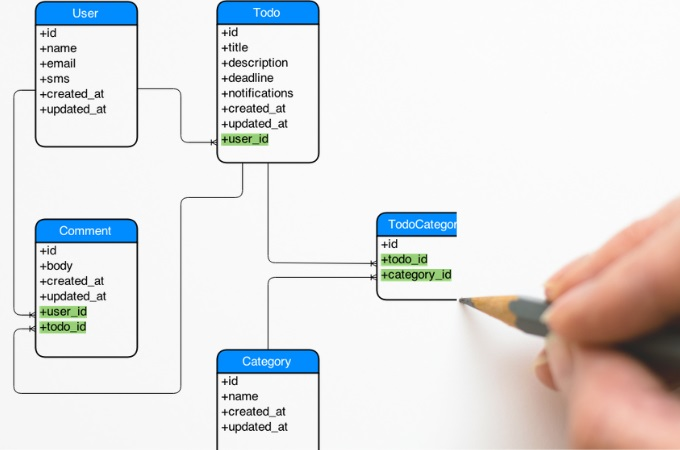

       

## Insuperable obstacle
When I first started coding, the experience of having good grades and excellence in the math contest in school before coming to college gave me a lot of frustration since I felt not talented in coding at the beginning. Of course, it may have been because the programming language was unfamiliar, but many competitive programming contests I encountered were out of my league that could not be overcome through effort. Looking at the achievements of famous students at MIT or STANFORD, I compared myself, and they seemed to go beyond human intelligence. There was a time I really put my life on the line because of the goals I mentioned earlier and greed of becoming the best. All my day was solving problems, designing systems, and devising complex ERD designs. What's important is that no matter how much I like it and how happy it is, when I do my best, I find it really crazy to hate it if it doesn't meet my expectations. Seeing other people write good code in a short time made me a little disappointed with the talentless me, and the burnout came. Since coding was started purely out of pleasure, there was no reason or room for coding anymore when the joy disappeared in my mind. The quote “Have the courage to follow your heart and intuition.” by Steve Jobs in my heart made me think about whether I should live as a developer or not. Now, having a firm belief that I would choose what I wanted to do as a job, I had a dream of being a developer through my changed mindset.
 
## How I gain the driving force behind all the current changes
Backend services start from understanding the backend framework and problem-solving ability to catch errors were more important than requiring knowledge of the data structures or algorithms. The wrong direction hindered the study of back-end services for a while. Forgetting the memory of competitive programming, I started looking for advantages for me from those around me who had to compete right away. I found that the perspective and observation of the problem were better than those of the ICS students around me, and the planning ability for the function of the projects before starting designing erd. Also, Quick response to existing errors and quickly resolve errors from new versions or new framework through debugging and references, which means a fast learning speed. As I discovered my strengths in this way, I became convinced that I would be better off in a different way from someone who would peak in a different field at MIT, Harvard, or StanFord. Rather than envious or disappointed by the achievements of people who are superior to me in other areas, I improved my weakness by learning and imitating their achievements. My current strength is to acquire new things quickly, and to accurately analyze for optimization or clean code, even if the speed is slow. Frequently encountering knowledge about various fields, I think of many needed functions that people might want when designing ERD with the ability to have a lot of perspectives on planning and diversity.
 
## The direction of my journey
Many people in the office find code errors and create clean code through Google, Stack Overflow, or ChatGpt. The ability to resolve errors through search is also a basic requirement for developers, but differentiated developers eventually find errors from the latest versions of the framework and language by debugging or references that cannot be solved through search. Rather than simply solving a problem that someone has solved, it is more important to try out problems or errors that have not yet been solved from various methods and perspectives. When an important ERD design at the backend is a very complex project, how accurately and quickly an optimized design can be made will determine the developer's ransom. Many IT companies in South Korea use absurd old versions of frameworks or systems that are easy to manage and easy to catch errors. As the conservative IT culture of the East country has continued for a long time, this situation has continued except for startups that have tried new things and large companies that accept foreign cultures. And while they still praise the emerging frameworks and languages, they often don't even try to accommodate them. Therefore, the goal for my journey is learning and using the latest open-source frameworks, database, pipelines platform for large-scale, complex and resilient services such as redis, kafka, or elastic search. Don't be afraid of updating the latest version, and want to be a developer who always studies and analyzes technologies and errors on my own.
