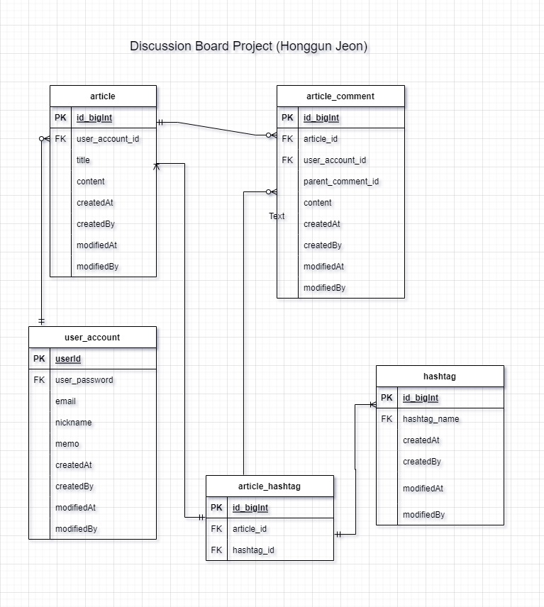

  

  

It is a spring board project where you can discuss with each other by posting posts such as reddit.
Springboot's JPA was used to create and implement connections between various entities. The basic functions are creating and deleting posts, hashtag posts, comments, and replies to comments. The login function service distinguishes authors with unique id. A post is an entity with a title, author, and text content, and all comments, post creation time, and modification time are recorded on the server.
 
The UI was created by referring to some code in the bootstrap.

  

   

Repo Url : 
