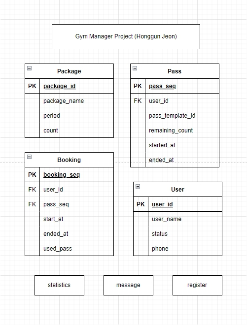

  
  

  

The Gym manager project is a spring batch-based project. The reason for using spring based is that it is a management field that collects and processes the jobs across the board rather than real-time processing. This is because spring batch is useful for payment settlement tasks, sending advertising messages at reservation times, building data for operation, and model learning tasks that require large amounts of data.
 

Design which steps to configure the job through jobrepository in the spring batch. It is a function related to the pass required when guests start or use the gym, an alarm sending function for new events or announcements, a deduction of personal training pass through asynchronous processing, and a statistical data reporter generation function for members' information. Also use docker-compose as MySql container.
 

Function Implemented:
  - Message for new events or announcements on the gym
  - Managing gym pass and the tickets for personal training
  - statistical data reporter generator handling huge data
  - managing payments (update soon)

Used Stacks:
- Spring Boot 2.7.3
- Spring Batch
- JPA
- MySql
- Docker
  

  

   

Repo Url : [Gym-manager-batch](https://github.com/gitCarrot/gym-manager)
