  

## Introduction

  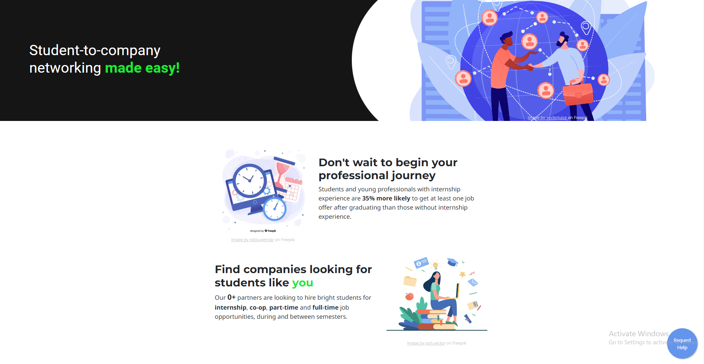
  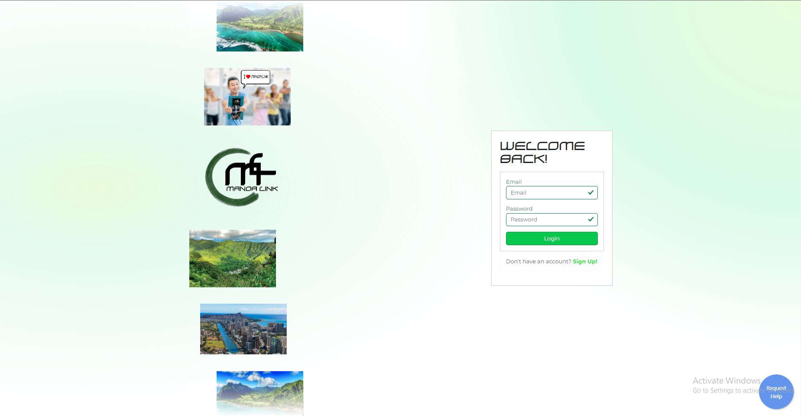

Manoa Link is an innovative web platform designed to bring students, job seekers, and companies together, simplifying the process of networking, career exploration, and industry event attendance. It offers tailored interfaces for students and companies, making it easier for users to connect, build relationships, and grow professionally.

## User Roles

Manoa Link has three user roles: students, company users, and admins. Each role has its own unique features and pages to cater to their specific needs.

## Key Features

User-friendly Registration: Manoa Link provides an easy registration process for students/job seekers (hirees) and organizations, ensuring a seamless onboarding experience.

Tailored Company and Student Views: The platform offers separate interfaces for companies and students, allowing them to manage listings, events, and applicants, or explore job opportunities and attend industry events, respectively.

Comprehensive Company Listings: Students can search through extensive company listings, filter by tags, and save their favorite organizations for future reference.

Upcoming Events: Manoa Link features a range of events, such as job fairs, workshops, and networking sessions, enabling students to engage with companies and professionals in their field.

Notification Management: The platform's notification system keeps users informed about important updates, such as new events, job openings, or changes to saved listings.

Event Archiving: Past events are automatically marked as "passed" to maintain a clean and organized user interface.

## Student Pages

Dashboard: Displays upcoming events, saved jobs, and suggested company listings for students.

  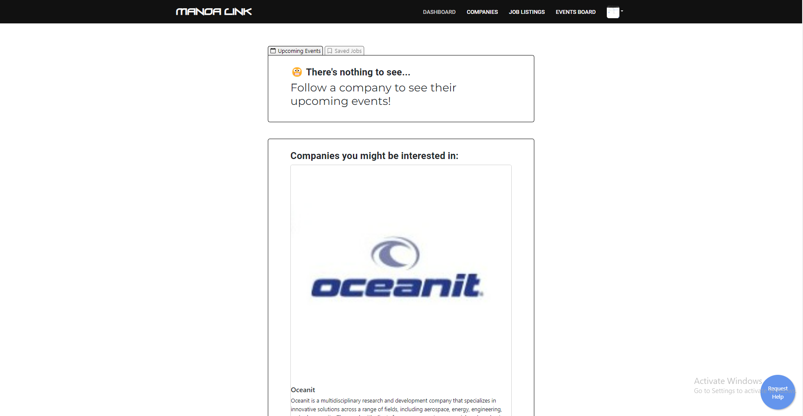
  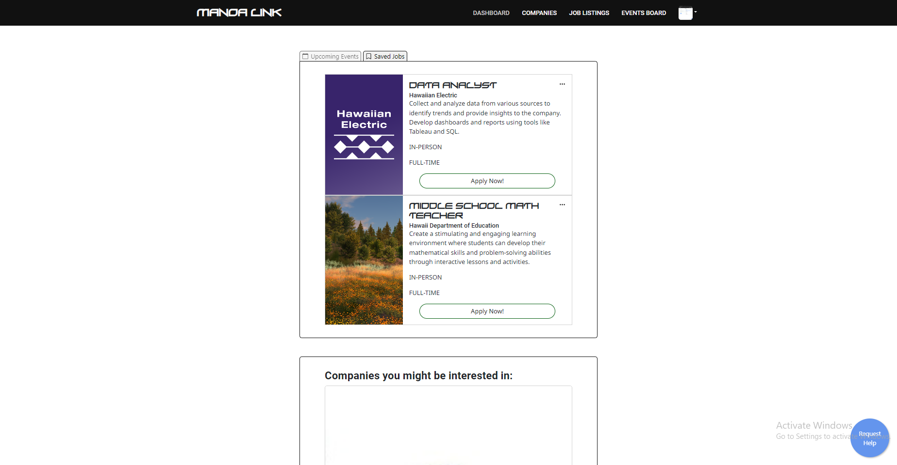

Company List: Allows students to follow/unfollow companies, view company websites, and access relevant information.

  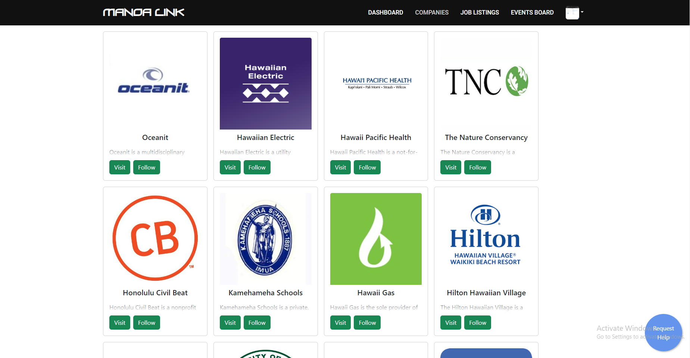

Job List: Provides details on available positions and allows students to apply for jobs.

  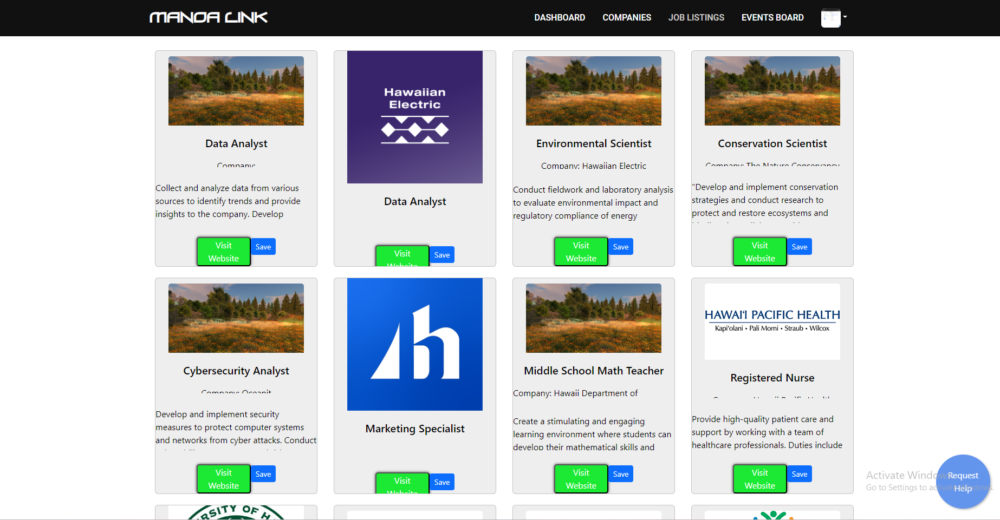

Event List: Showcases upcoming and past events, with filtering options and the ability to save/unsave events.

  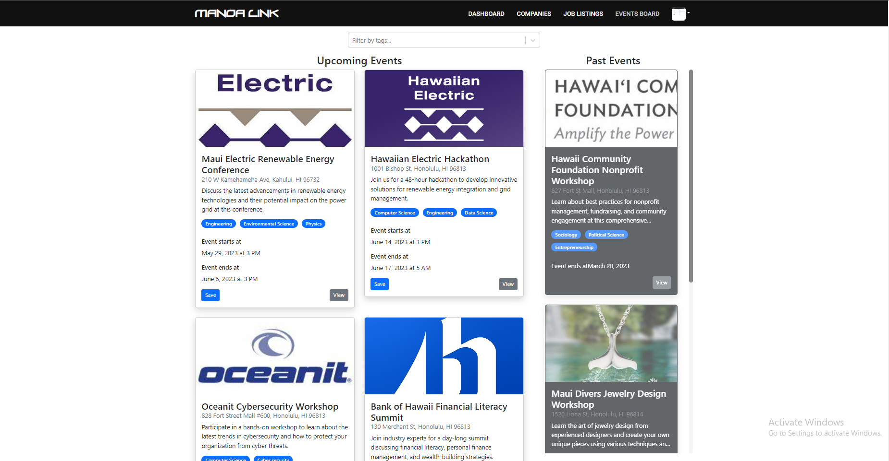
  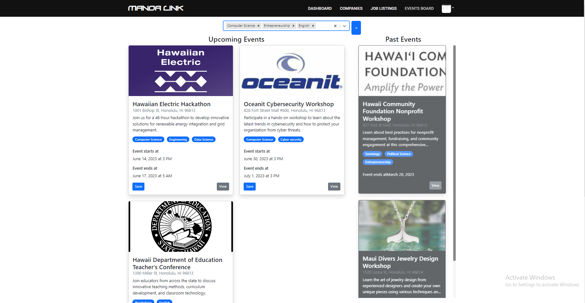

## Company Pages

Dashboard: Allows companies to manage event and job schedules.

  

Event Management: Enables companies to add, edit, or remove events.

  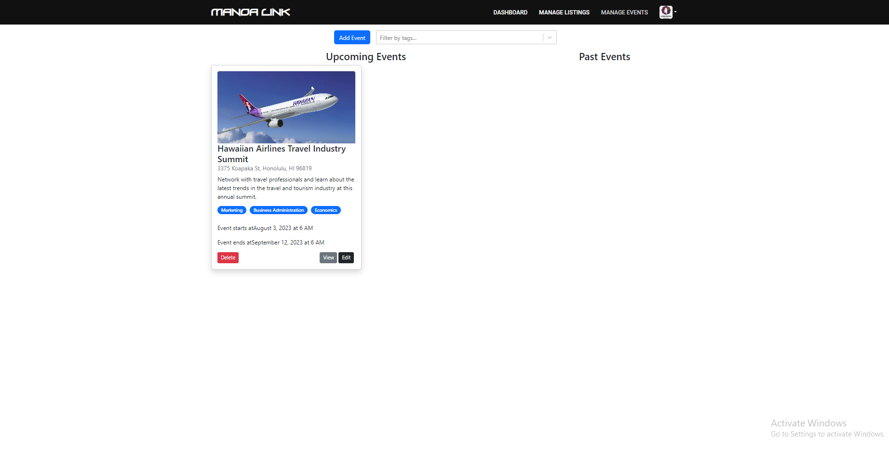

  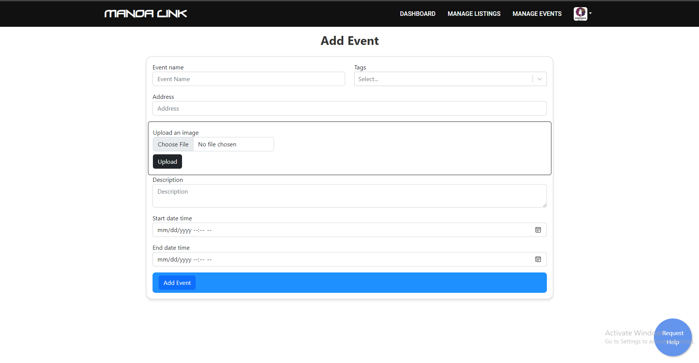
   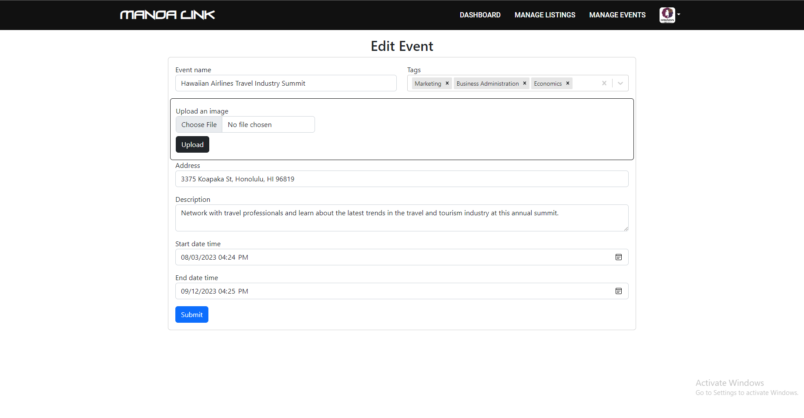

Job Management: Provides tools for companies to create, update, or delete job listings.

  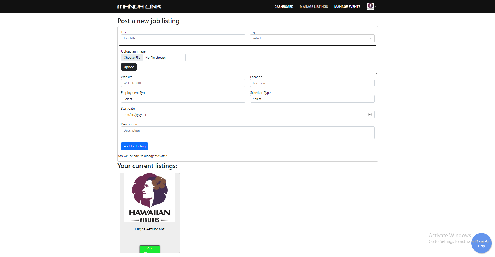

## Admin Pages

Dashboard: Admins can manage all events, companies, jobs, and users, with options to edit, delete, or add new entries.

  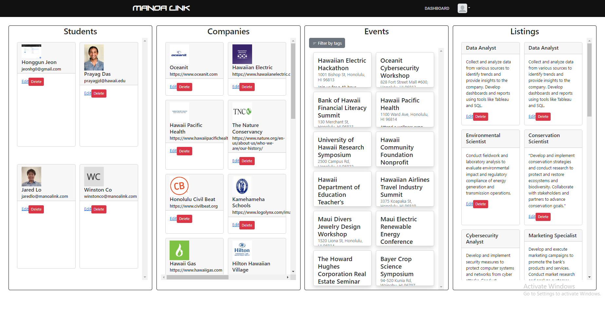

Conclusion

Manoa Link is a comprehensive platform that simplifies the process of connecting students and companies, streamlining job searching and event attendance. With tailored features and pages for each user role, Manoa Link fosters growth and creates meaningful connections, paving the way for successful careers and thriving organizations.

Repo Url : [Manoa Link](https://github.com/uhmanoalink/manoa-link)
